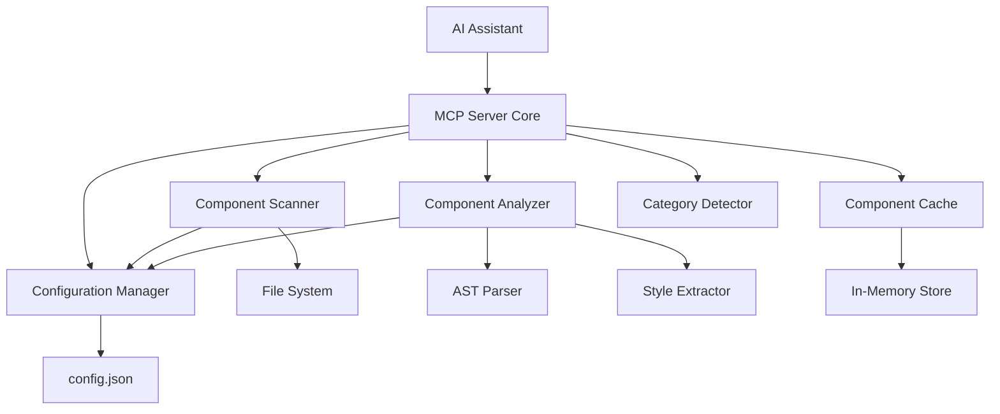

# Component Design System MCP Server - 詳細設計書

## 概要

Component Design System MCPサーバーは、AIアシスタントが既存のコンポーネントライブラリとデザインシステムを理解し、一貫性のある開発を支援するためのModel Context Protocol (MCP) サーバーです。

### 解決する課題
1. **重複コンポーネントの作成防止**: AIが既存コンポーネントを無視して一から作成する問題
2. **デザイン一貫性の維持**: 新しく作成される画面が既存のトンマナを反映しない問題
3. **効率的な開発支援**: 既存のコンポーネント情報を活用した迅速な開発

## アーキテクチャ設計

### システム全体構成



### コアコンポーネント

#### 1. MCP Server Core
- MCPプロトコルの実装
- ツールの登録と管理
- リクエスト/レスポンスの処理

#### 2. Configuration Manager
- 設定ファイルの読み込み・管理
- デフォルト設定の提供
- 設定変更の自動検知

#### 3. Component Scanner
- ディレクトリの再帰的スキャン
- コンポーネントファイルの識別
- 除外パターンの適用

#### 4. Component Analyzer
- AST解析によるメタデータ抽出
- Props情報の抽出
- スタイル情報の解析
- 依存関係の分析

#### 5. Category Detector
- ディレクトリ構造からのカテゴリ推測
- ファイル名パターンからのカテゴリ推測
- 利用可能カテゴリの管理

#### 6. Component Cache
- 解析結果のインメモリキャッシュ
- ファイル変更検知
- キャッシュ無効化

## データモデル設計

### ComponentInfo
```typescript
interface ComponentInfo {
  name: string                    // コンポーネント名
  filePath: string               // ファイルパス
  framework: 'react-native' | 'tailwind' | 'unknown'
  props: PropInfo[]              // Props情報
  styles: StyleInfo[]            // スタイル情報
  usageExamples: string[]        // 使用例
  dependencies: string[]         // 依存関係
  category: string               // カテゴリ
  description?: string           // 説明
  lastModified: Date            // 最終更新日時
}

interface PropInfo {
  name: string                   // プロパティ名
  type: string                   // 型情報
  required: boolean              // 必須フラグ
  defaultValue?: any            // デフォルト値
  description?: string          // 説明
}

interface StyleInfo {
  property: string              // スタイルプロパティ
  value: string                 // 値
  frequency: number             // 使用頻度
  context: 'className' | 'style' | 'theme'
}
```

### DesignSystemInfo
```typescript
interface DesignSystemInfo {
  colors: ColorPalette           // カラーパレット
  typography: TypographySystem   // タイポグラフィ
  spacing: SpacingSystem         // スペーシング
  commonPatterns: StylePattern[] // 共通パターン
  extractedAt: Date             // 抽出日時
}

interface ColorPalette {
  primary: ColorInfo[]
  secondary: ColorInfo[]
  neutral: ColorInfo[]
  semantic: {
    success: ColorInfo[]
    warning: ColorInfo[]
    error: ColorInfo[]
    info: ColorInfo[]
  }
}

interface ColorInfo {
  name: string                  // 色名
  value: string                 // 色値 (hex, rgb, etc.)
  usage: number                 // 使用回数
  contexts: string[]            // 使用コンテキスト
}

interface TypographySystem {
  fontSizes: Record<string, FontSizeInfo>
  fontWeights: Record<string, FontWeightInfo>
  lineHeights: Record<string, LineHeightInfo>
  fontFamilies: Record<string, FontFamilyInfo>
}

interface SpacingSystem {
  margins: Record<string, SpacingInfo>
  paddings: Record<string, SpacingInfo>
  gaps: Record<string, SpacingInfo>
}
```

### Configuration
```typescript
interface Config {
  scanPaths: string[]                    // スキャン対象パス
  excludePatterns: string[]              // 除外パターン
  frameworks: FrameworkConfig[]          // フレームワーク設定
  componentPatterns: string[]            // コンポーネントファイルパターン
  cacheEnabled: boolean                  // キャッシュ有効フラグ
  autoRefresh: boolean                   // 自動更新フラグ
  refreshInterval: number                // 更新間隔（秒）
}

interface FrameworkConfig {
  name: 'react-native' | 'tailwind'
  enabled: boolean
  fileExtensions: string[]               // 対象ファイル拡張子
  componentPatterns: string[]            // コンポーネント識別パターン
  stylePatterns: string[]                // スタイル識別パターン
}
```

## MCPツール設計

### 1. list_components
```typescript
// 用途: 全コンポーネントの一覧取得
// 入力: category?: string, framework?: string
// 出力: ComponentSummary[]
interface ComponentSummary {
  name: string
  filePath: string
  framework: string
  category: string
  propsCount: number
  lastModified: Date
}
```

### 2. get_component_details
```typescript
// 用途: 特定コンポーネントの詳細情報取得
// 入力: name: string
// 出力: ComponentDetails
interface ComponentDetails extends ComponentInfo {
  similarComponents: ComponentMatch[]
  usageFrequency: number
  relatedComponents: string[]
}
```

### 3. find_similar_components
```typescript
// 用途: 類似コンポーネントの検索
// 入力: description: string, props?: PropInfo[]
// 出力: ComponentMatch[]
interface ComponentMatch {
  component: ComponentInfo
  similarity: number                     // 類似度 (0-1)
  matchReasons: string[]                // マッチ理由
  differences: string[]                 // 相違点
}
```

### 4. get_design_system
```typescript
// 用途: デザインシステム情報の取得
// 入力: category?: string
// 出力: DesignSystemInfo
```

### 5. get_available_categories
```typescript
// 用途: 利用可能カテゴリの取得
// 入力: なし
// 出力: CategoryInfo[]
interface CategoryInfo {
  name: string
  componentCount: number
  description: string
  examples: string[]
}
```

### 6. get_screen_patterns
```typescript
// 用途: 画面パターンの取得
// 入力: category?: string
// 出力: ScreenPattern[]
interface ScreenPattern {
  name: string
  category: string
  structure: ComponentStructure
  commonStyles: StyleInfo[]
  usageExamples: string[]
}
```

## フレームワーク対応設計

### React Native対応
```typescript
class ReactNativeAnalyzer implements FrameworkAnalyzer {
  // JSX要素の解析
  analyzeJSXElements(ast: AST): ComponentInfo[]
  
  // StyleSheet.create の解析
  analyzeStyleSheets(ast: AST): StyleInfo[]
  
  // Props型定義の抽出
  extractPropsInterface(ast: AST): PropInfo[]
  
  // React Native固有のコンポーネント識別
  identifyNativeComponents(ast: AST): string[]
}
```

### TailwindCSS対応
```typescript
class TailwindAnalyzer implements FrameworkAnalyzer {
  // className属性の解析
  analyzeClassNames(ast: AST): StyleInfo[]
  
  // Tailwind設定ファイルの解析
  analyzeTailwindConfig(configPath: string): DesignSystemInfo
  
  // カスタムクラスの抽出
  extractCustomClasses(ast: AST): StyleInfo[]
  
  // レスポンシブデザインパターンの抽出
  extractResponsivePatterns(ast: AST): StylePattern[]
}
```

### 拡張可能な設計
```typescript
interface FrameworkAnalyzer {
  name: string
  supportedExtensions: string[]
  
  canAnalyze(filePath: string): boolean
  analyzeComponent(filePath: string): Promise<ComponentInfo>
  extractStyles(ast: AST): StyleInfo[]
  extractProps(ast: AST): PropInfo[]
}

class FrameworkRegistry {
  private analyzers: Map<string, FrameworkAnalyzer> = new Map()
  
  register(analyzer: FrameworkAnalyzer): void
  getAnalyzer(framework: string): FrameworkAnalyzer | null
  getSupportedFrameworks(): string[]
}
```

## カテゴリ検出システム

### ディレクトリベース検出
```typescript
class DirectoryBasedCategoryDetector {
  // パスパターンからカテゴリを推測
  detectFromPath(filePath: string): string {
    const patterns = [
      { pattern: /\/screens?\/auth\//, category: 'auth' },
      { pattern: /\/components?\/forms?\//, category: 'forms' },
      { pattern: /\/pages?\/user/, category: 'user' },
      { pattern: /\/components?\/ui\//, category: 'ui' },
      { pattern: /\/screens?\/.*list/i, category: 'list' },
      { pattern: /\/screens?\/.*detail/i, category: 'detail' }
    ]
    
    for (const { pattern, category } of patterns) {
      if (pattern.test(filePath)) return category
    }
    
    return 'general'
  }
}
```

### ファイル名ベース検出
```typescript
class FileNameBasedCategoryDetector {
  detectFromFileName(fileName: string): string {
    const patterns = [
      { pattern: /login|signin|auth/i, category: 'auth' },
      { pattern: /button|input|form/i, category: 'forms' },
      { pattern: /list|table|grid/i, category: 'list' },
      { pattern: /detail|info|profile/i, category: 'detail' },
      { pattern: /modal|dialog|popup/i, category: 'overlay' },
      { pattern: /header|footer|nav/i, category: 'layout' }
    ]
    
    for (const { pattern, category } of patterns) {
      if (pattern.test(fileName)) return category
    }
    
    return 'general'
  }
}
```

## 類似性判定アルゴリズム

### コンポーネント名の類似性
```typescript
class ComponentSimilarityMatcher {
  calculateNameSimilarity(name1: string, name2: string): number {
    // Levenshtein距離ベースの類似度計算
    // 共通接頭辞・接尾辞の考慮
    // 意味的類似性の判定（Button vs Btn など）
  }
  
  calculatePropsSimilarity(props1: PropInfo[], props2: PropInfo[]): number {
    // Props名の一致度
    // 型の互換性
    // 必須プロパティの一致度
  }
  
  calculateStyleSimilarity(styles1: StyleInfo[], styles2: StyleInfo[]): number {
    // スタイルプロパティの一致度
    // 値の類似性
    // 使用頻度の考慮
  }
}
```

## エラーハンドリング設計

### エラー分類
```typescript
enum ErrorType {
  FILE_SYSTEM_ERROR = 'file_system_error',
  PARSE_ERROR = 'parse_error',
  CONFIGURATION_ERROR = 'configuration_error',
  MCP_PROTOCOL_ERROR = 'mcp_protocol_error',
  CACHE_ERROR = 'cache_error'
}

class ComponentAnalysisError extends Error {
  constructor(
    public type: ErrorType,
    public filePath: string,
    public originalError: Error,
    message: string
  ) {
    super(message)
  }
}
```

### エラー処理戦略
```typescript
class ErrorHandler {
  handleFileSystemError(error: Error, filePath: string): void {
    // ログ記録
    // 他のファイル処理に影響しないよう継続
    // ユーザーへの警告表示
  }
  
  handleParseError(error: Error, filePath: string): ComponentInfo | null {
    // 部分的な情報でも抽出可能な場合は継続
    // 完全に失敗した場合はnullを返す
    // エラー詳細をログに記録
  }
  
  handleConfigError(error: Error): Config {
    // デフォルト設定でフォールバック
    // 設定エラーの詳細をログに記録
    // ユーザーに設定修正を促す
  }
}
```

## パフォーマンス最適化

### キャッシュ戦略
```typescript
class ComponentCache {
  private cache: Map<string, CacheEntry> = new Map()
  private fileWatcher: FileWatcher
  
  interface CacheEntry {
    data: ComponentInfo
    lastModified: Date
    accessCount: number
    lastAccessed: Date
  }
  
  // ファイル変更検知による自動無効化
  invalidateOnFileChange(filePath: string): void
  
  // LRU方式によるメモリ管理
  evictLeastRecentlyUsed(): void
  
  // 統計情報の提供
  getCacheStats(): CacheStats
}
```

### 並列処理
```typescript
class ParallelComponentScanner {
  async scanDirectoriesInParallel(paths: string[]): Promise<ComponentInfo[]> {
    // ワーカープールを使用した並列スキャン
    // CPU集約的なAST解析の並列化
    // メモリ使用量の制御
  }
}
```

## テスト戦略

### 単体テスト
```typescript
// Component Scanner のテスト
describe('ComponentScanner', () => {
  test('should find React Native components', async () => {
    // テストディレクトリの作成
    // コンポーネントファイルの発見確認
    // 除外パターンの動作確認
  })
})

// Component Analyzer のテスト
describe('ComponentAnalyzer', () => {
  test('should extract props from TypeScript interface', async () => {
    // サンプルコンポーネントの解析
    // Props情報の正確性確認
    // エラーハンドリングの確認
  })
})
```

### 統合テスト
```typescript
describe('MCP Server Integration', () => {
  test('should handle complete component analysis workflow', async () => {
    // 実際のプロジェクト構造でのテスト
    // MCPプロトコル通信のテスト
    // エンドツーエンドの動作確認
  })
})
```

### パフォーマンステスト
```typescript
describe('Performance Tests', () => {
  test('should handle large projects efficiently', async () => {
    // 1000+コンポーネントでのテスト
    // メモリ使用量の測定
    // レスポンス時間の測定
  })
})
```

## 実装フェーズ

### Phase 1: 基盤構築 (1-2週間)
- [ ] TypeScriptプロジェクトの初期化
- [ ] MCPサーバーの基本構造実装
- [ ] 設定ファイル管理システム
- [ ] 基本的なファイルスキャナー
- [ ] 単体テストの基盤

### Phase 2: コンポーネント解析 (2-3週間)
- [ ] AST解析エンジンの実装
- [ ] React Native対応
- [ ] TailwindCSS対応
- [ ] コンポーネントメタデータ抽出
- [ ] カテゴリ検出システム

### Phase 3: 高度な機能 (2-3週間)
- [ ] 類似コンポーネント検索
- [ ] デザインシステム解析
- [ ] 画面パターン抽出
- [ ] キャッシュシステム
- [ ] エラーハンドリング強化

### Phase 4: 最適化と拡張 (1-2週間)
- [ ] パフォーマンス最適化
- [ ] 拡張性の向上
- [ ] 統合テスト
- [ ] ドキュメント整備

## 技術スタック

### 開発環境
- **言語**: TypeScript
- **ランタイム**: Node.js
- **パッケージマネージャー**: npm/yarn
- **テストフレームワーク**: Jest
- **リンター**: ESLint + Prettier

### 主要ライブラリ
- **MCP**: @modelcontextprotocol/sdk
- **AST解析**: @typescript-eslint/parser, @babel/parser
- **ファイル監視**: chokidar
- **設定管理**: cosmiconfig
- **ログ**: winston
- **テスト**: jest, @testing-library

### 設定ファイル例
```json
{
  "scanPaths": ["./src", "./components", "./screens"],
  "excludePatterns": ["node_modules", "*.test.*", "*.spec.*"],
  "frameworks": [
    {
      "name": "react-native",
      "enabled": true,
      "fileExtensions": [".tsx", ".jsx"],
      "componentPatterns": ["*Screen.tsx", "*Component.tsx"],
      "stylePatterns": ["StyleSheet.create", "styled-components"]
    },
    {
      "name": "tailwind",
      "enabled": true,
      "fileExtensions": [".tsx", ".jsx", ".html"],
      "componentPatterns": ["className="],
      "stylePatterns": ["@apply", "tailwind.config.*"]
    }
  ],
  "cacheEnabled": true,
  "autoRefresh": true,
  "refreshInterval": 300
}
```

## 期待される効果

### 開発効率の向上
- 重複コンポーネント作成の削減: 30-50%
- 既存コンポーネント発見時間の短縮: 80%
- デザイン一貫性の向上: 70%

### AI支援の改善
- 適切なコンポーネント選択率の向上: 60%
- トンマナ一貫性の向上: 80%
- 開発速度の向上: 40%

## まとめ

この設計書に基づいて実装することで、AIアシスタントが既存のコンポーネントライブラリとデザインシステムを理解し、一貫性のある効率的な開発を支援するMCPサーバーを構築できます。

拡張可能な設計により、将来的な新しいフレームワークやライブラリへの対応も容易になり、長期的な保守性も確保されます。
