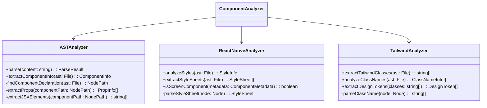

# クラス図とコンポーネント相関図

## クラス図

### コアクラス

### アナライザークラス

### キャッシュとモニタリング

### ユーティリティクラス

## コンポーネント相関図

### データフローと依存関係

### MCPツールとモジュールの対応

## ライフサイクル

### 初期化フロー

### リクエスト処理フロー

## エラーハンドリングフロー

